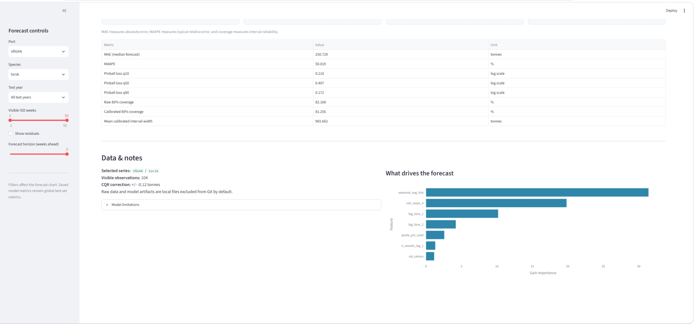

# Fjord Catch Forecast (FCF)

FCF forecasts weekly landed catch for Norwegian ports by port, species, and ISO week. It reports a median estimate together with a calibrated uncertainty interval for the same weekly forecast.

## At a glance

- Norwegian Fisheries Directorate landings combined with Copernicus Marine features
- XGBoost q10, q50, and q90 quantile forecasts
- CQR-calibrated nominal 80% uncertainty intervals
- Streamlit dashboard with optional local Docker setup

## Dashboard preview

Gray dots are actual landings, the blue line is the median forecast, and the shaded band is the calibrated nominal 80% uncertainty interval.

<p align="center">
  
</p>

## Results

Evaluation uses the 2024–2025 held-out test period.

| Metric | Held-out test result | Meaning |
|---|---:|---|
| MAE | 249.57 t | Average absolute error in weekly landed catch |
| MdAPE | 50.66% | Typical relative error, more stable than MAPE near low catch volumes |
| Calibrated nominal-80% coverage | 80.55% | Share of actual observations inside the reported calibrated interval |

The purpose is to provide a useful central estimate together with uncertainty, rather than a falsely precise single-number forecast.

<p align="center">
  
</p>

> Dashboard filters change the displayed forecast series. Saved headline metrics describe the global held-out test evaluation.

## Approach

1. Annual landing records and marine data are ingested and merged.
2. Data is aggregated to weekly port × species × ISO-week observations.
3. Lag, seasonal, fleet-effort, and ocean-condition features are engineered.
4. XGBoost quantile models estimate q10, q50, and q90 on log1p(tons).
5. CQR uses 2023 as a separate calibration period.
6. Final evaluation uses the untouched 2024–2025 test period.

## Model diagnostics

Feature importance is based on XGBoost gain and helps inspect model behaviour, but it does not establish causal effects.

<p align="center">
  
</p>

## Run locally

```bash
python -m venv .venv
```

For activation on Windows PowerShell:

```powershell
.venv\Scripts\activate
```

For activation on macOS or Linux:

```bash
source .venv/bin/activate
```

Then:

```bash
pip install -r requirements.txt
python run_pipeline.py
streamlit run app.py
```

The dashboard opens at `http://localhost:8501`.

<details>
  <summary>Optional step-by-step pipeline commands</summary>

```bash
python src/ingest_fiskeridir.py
python src/ingest_copernicus.py
python src/merge_sources.py
python src/features.py
python src/feature_selection.py
python src/train.py
```

</details>

## Docker

```bash
docker compose up --build
```

The dashboard opens at `http://localhost:8501`.

```bash
docker compose down
```

Docker runs the dashboard locally and mounts local `data/` and `models/` directories. Data and model artifacts must be generated or placed locally before use; they are not baked into the image.

## Data and artifacts

- Fisheries Directorate CSV files belong in `data/raw/fiskeridir/`.
- Prepared Copernicus features belong in `data/ocean_features.csv`.
- Merged training data is stored locally under `data/`.
- Generated model artifacts are stored locally under `models/`.
- Copernicus Marine access may require account configuration.
- Raw data and generated artifacts are local by default.

## Limitations and responsible use

- Ocean inputs currently use historical Copernicus reanalysis rather than guaranteed future operational conditions.
- Forward scenario views carry selected recent conditions forward and are not live weather forecasts.
- `quota_pct_used` is a catch-based proxy, not official port-level quota data.
- The model cannot anticipate shocks not represented in historical data, such as regulation changes or fleet disruptions.
- MAPE can be unstable when actual catch is near zero; interpret MAE and MdAPE alongside it.
- The catch-segment experiment is an oracle diagnostic because labels use realized outcomes; a deployable version would need a pre-forecast classifier.

## Project structure

```text
FCF/
├── app.py
├── config.py
├── requirements.txt
├── Dockerfile
├── docker-compose.yml
├── run_pipeline.py
├── scripts/
├── reports/
├── data/
├── models/
└── src/
```

## Roadmap

- Add a pre-forecast anomaly or regime-gating classifier
- Test mixture-of-experts models for catch regimes
- Add reliable fishing-ground or catch-location features
- Replace historical reanalysis inputs with operational forecast products

## Data credits and license

FCF uses Norwegian Fisheries Directorate and Copernicus Marine data. Users must obtain the data themselves and follow the applicable licenses, attribution requirements, and terms of use. For the detailed evaluation note, see [reports/final_evaluation.md](reports/final_evaluation.md).
